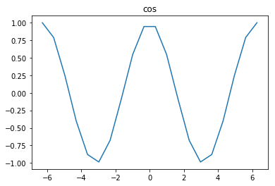
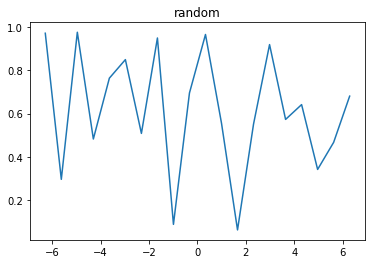

```python
hello,
build a slides here
'''this is a title'''
''title two
```


```python
import numpy as np
import matplotlib.pyplot as plt
```


```python
x = np.linspace(-2*np.pi, 2*np.pi, 20)
y1 = np.cos(x)
print("x = %s,\n y = %s" % (x,y1))
```


```python
plt.title("cos")
plt.plot(x, y1)
```


    [<matplotlib.lines.Line2D at 0x27cc9851dd8>]





```python
y2 = np.random.random(20)
```


```python
plt.title("random")
plt.plot(x,y2)
```


    [<matplotlib.lines.Line2D at 0x27cc996f240>]




